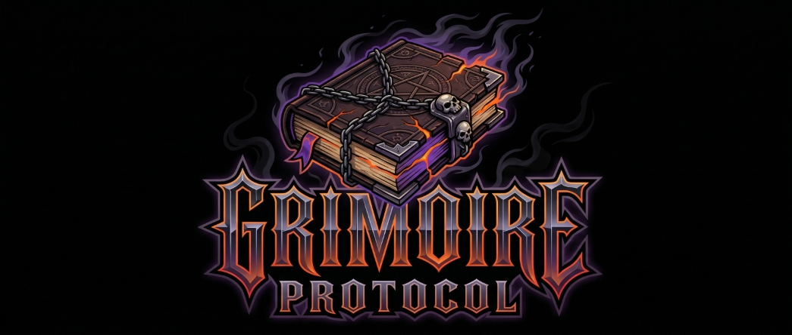

<div align="center">



# Grimoire Protocol

**Your AI gets smarter every session. Automatically.**

[](../../releases)
[](LICENSE)
[](#quick-start)
[](https://go.dev)
[](https://obsidian.md)

A compiled knowledge base for your Obsidian vault. Captures sessions, compiles wiki articles, feeds knowledge back.

**Works with any MCP-compatible agent:**


</div>

---

Grimoire Protocol is a compiled knowledge base for [Obsidian](https://obsidian.md) vaults. It captures what happens in your Claude Code sessions, compiles it into structured wiki articles, and feeds that knowledge back into every future session. The more you use it, the more it knows. The more it knows, the less you repeat yourself.

No API keys. No vector database setup. No cloud services. Just your vault, your Claude subscription, and a Go binary that handles the plumbing.

---

## What It Actually Does

```
You have a conversation
    ↓
Hooks capture it to inbox/
    ↓
/grimoire compile processes it
    ↓
Wiki articles appear in wiki/
    ↓
Next session starts with that knowledge loaded
    ↓
Repeat forever. Knowledge compounds.
```

**Three things happen automatically:**
1. **SessionStart hook** loads your compiled knowledge (~500 tokens) into every new session
2. **SessionEnd hook** captures conversation transcripts for later compilation
3. **PreCompact hook** saves context before Claude's auto-compaction eats it

**You trigger the rest:**
- `/grimoire compile` — process pending captures into wiki articles
- `/grimoire query` — ask your knowledge base anything
- `/grimoire status` — see how big your brain has gotten
- `/grimoire lint` — health check for stale or broken articles

Or just talk naturally — "what does the grimoire know about auth patterns?" works too.

---

## The Pipeline

```
  ┌─────────┐     ┌───────────┐     ┌─────────┐     ┌─────────┐     ┌─────────┐
  │  DROP   │────>│ SUMMARISE │────>│ EXTRACT │────>│  WRITE  │────>│  QUERY  │
  │         │     │           │     │         │     │         │     │         │
  │ Sources │     │ Concise   │     │Concepts │     │ Wiki    │     │ Search  │
  │ into    │     │ summaries │     │Entities │     │articles │     │ & ask   │
  │ inbox/  │     │ per file  │     │Links    │     │with FTS │     │anything │
  └─────────┘     └───────────┘     └─────────┘     └─────────┘     └─────────┘
```

Drop anything into `inbox/` — markdown, PDFs, Word docs, code files, images, even emails. The compiler chews through it all.

---

## Supported Source Formats

The grimoire engine handles format detection automatically. Just drop files in and it figures out the rest.

| Format | Extensions | What Gets Extracted |
|---|---|---|
| **Markdown** | `.md` | Body text, frontmatter parsed separately |
| **PDF** | `.pdf` | Full text (pure Go extraction, no external deps) |
| **Word** | `.docx` | Document text from XML |
| **Excel** | `.xlsx` | Cell values and sheet data |
| **PowerPoint** | `.pptx` | Slide text content |
| **CSV** | `.csv` | Headers + rows (up to 1,000 rows) |
| **EPUB** | `.epub` | Chapter text from XHTML |
| **Email** | `.eml` | From/To/Subject/Date + body |
| **Plain Text** | `.txt`, `.log` | Raw content |
| **Transcripts** | `.vtt`, `.srt` | Subtitle/caption content |
| **Images** | `.png`, `.jpg`, `.gif`, `.webp`, `.svg` | Vision LLM describes content, captions, visible text |
| **Code** | `.go`, `.py`, `.js`, `.ts`, `.rs`, etc. | Source code as-is |

---

## How It's Built

Grimoire Protocol is a hybrid of three open-source projects, combined into something that's more than the sum of its parts:

| Layer | What | From |
|---|---|---|
| **Engine** | SQLite + FTS5 search, 15 MCP tools, web UI | [sage-wiki](https://github.com/xoai/sage-wiki) |
| **UX Patterns** | Hot cache, query cascade, frontmatter schema, lint | [claude-obsidian](https://github.com/AgriciDaniel/claude-obsidian) |
| **Capture** | Session hooks, recursion guards, transcript extraction | [claude-memory-compiler](https://github.com/coleam00/claude-memory-compiler) |

The key insight: sage-wiki handles storage and retrieval. Your Claude subscription handles all the thinking. Compile once, query forever — zero ongoing API cost.

Based on [Andrej Karpathy's LLM Wiki pattern](https://gist.github.com/karpathy/442a6bf555914893e9891c11519de94f).

---

## What You Need

- **[Claude Code](https://claude.ai/claude-code)** with a Pro, Max or Team subscription (this is the brain)
- **[Python 3.12+](https://python.org/)** (for hook scripts — stdlib only, no pip installs)
- **[Obsidian](https://obsidian.md/)** (optional but recommended — the wiki is just markdown, any editor works)
- **[Obsidian CLI](https://obsidian.md/cli)** (Companion CLI to Obsidian, also recommended to turn on)
- **[Obsidian Web Clipper](https://obsidian.md/clipper)** (Companion Web Clipper extension for Chrome and Firefox - Clip anything to your inbox as markdown from the web and let Grimoire compile it for you)

**To build from source** (optional — pre-built binaries are available in [Releases](../../releases)):
- [Go 1.22+](https://go.dev/dl/)
- [Node.js](https://nodejs.org/) (for the web UI frontend)

---

## Quick Start

### Option A: Download a Pre-Built Binary

1. Grab the binary for your platform from [Releases](../../releases)
2. Place it somewhere you'll remember (we'll reference this path later)
3. Skip to **Step 2: Set Up Your Vault**

### Option B: Build From Source

```bash
# Clone this repo
git clone https://github.com/dknz7/grimoire-protocol.git
cd grimoire-protocol

# Clone the engine
git clone https://github.com/xoai/sage-wiki.git _build/sage-wiki

# Build the web UI frontend
cd _build/sage-wiki/web && npm install && npm run build && cd ../../..

# Compile the binary (pick your platform)
# macOS Apple Silicon:
cd _build/sage-wiki && go build -tags webui -o ../../bin/grimoire ./cmd/sage-wiki/ && cd ../..

# macOS Intel:
# GOARCH=amd64 go build -tags webui -o ../../bin/grimoire ./cmd/sage-wiki/

# Windows:
# GOOS=windows go build -tags webui -o ../../bin/grimoire.exe ./cmd/sage-wiki/

# Linux:
# go build -tags webui -o ../../bin/grimoire ./cmd/sage-wiki/

# Clean up the build folder
rm -rf _build
```

Your binary is now at `bin/grimoire` (or `bin/grimoire.exe` on Windows).

---

### Step 2: Set Up Your Vault

Pick an Obsidian vault (or any folder — Obsidian is optional). We'll call this your **vault root**.

**Create the directory structure:**

```bash
cd /path/to/your/vault

# Grimoire binary
mkdir -p .grimoire
cp /path/to/grimoire .grimoire/grimoire    # or grimoire.exe on Windows

# Capture inbox
mkdir -p inbox/{sessions,tldr,daily,drops}

# Wiki output (the grimoire itself)
mkdir -p wiki/{concepts,entities,sources,connections,questions,meta}

# Engine storage
mkdir -p .sage

# Hook scripts
mkdir -p scripts/grimoire
```

**Or use the scaffold script** (does all the above for you):

```bash
# macOS/Linux
./scaffold.sh /path/to/your/vault /path/to/grimoire

# Windows (PowerShell)
.\scaffold.ps1 -VaultPath "C:\path\to\your\vault" -BinaryPath "C:\path\to\grimoire.exe"
```

---

### Step 3: Copy Skills & Hooks

```bash
# Copy all skills to your vault's Claude Code skills directory
cp -r skills/* /path/to/your/vault/.claude/skills/

# Copy hook scripts
cp hooks/* /path/to/your/vault/scripts/grimoire/
```

---

### Step 4: Configure

**Engine config** — copy `config/config.yaml.template` to your vault root as `config.yaml`. Customise the source folders and timezone.

**MCP server** — you need to register the grimoire engine with Claude Code. The config location varies by setup, so you'll need to find where YOUR existing MCP servers are configured. Common locations:

| Location | When to use |
|---|---|
| `~/.claude.json` | Most common for global MCP servers (check for a `mcpServers` key) |
| `~/.claude/settings.json` | Some setups use this instead |
| `<vault>/.mcp.json` | Project-level only (works when Claude Code is opened in the vault) |
| `~/Library/Application Support/Claude/claude_desktop_config.json` | macOS Claude desktop app |
| `%APPDATA%\Claude\claude_desktop_config.json` | Windows Claude desktop app |

**How to find yours:** If you already have MCP servers running (like TickTick, SequentialThinking, etc.), search for their names in the files above. Whichever file contains them is where grimoire should go too.

Add this to the `mcpServers` section of that file:

```json
"grimoire": {
  "type": "stdio",
  "command": "/path/to/your/vault/.grimoire/grimoire",
  "args": ["serve", "--project", "/path/to/your/vault"],
  "env": {}
}
```

On Windows, use double backslashes: `"C:\\path\\to\\vault\\.grimoire\\grimoire.exe"`

The scaffold script (`scaffold.sh` / `scaffold.ps1`) will scan these locations automatically and show you what it finds.

**Hooks & permissions** — similarly, find which file holds your existing hooks or permissions and merge in the grimoire hooks. See `config/settings-hooks.json.template` for the full JSON structure. Hook commands use absolute paths to the vault's `scripts/grimoire/` folder, so they work from any Claude Code session regardless of working directory.

**Windows users — important gotcha:** Claude Code runs hooks through **bash** (Git Bash), not PowerShell. This means hook commands must use forward-slash paths, not backslashes:

```
# Correct (bash-compatible):
/c/Users/you/AppData/Local/Python/python.exe "/c/Users/you/vault/scripts/grimoire/session-start.py"

# Wrong (will fail silently):
C:\Users\you\AppData\Local\Python\python.exe C:\Users\you\vault\scripts\grimoire\session-start.py
```

Quote any paths with spaces. The PowerShell scaffold script will auto-convert paths for you.

**Obsidian users** — copy `obsidian/snippets/grimoire-colors.css` to your vault's `.obsidian/snippets/` folder, then enable it in Obsidian: Settings > Appearance > CSS Snippets > toggle on `grimoire-colors`.

**Version control** — if you use git for your vault, copy `config/vault-gitignore.template` to your vault root as `.gitignore` (or merge the entries into your existing one).

---

### Step 5: Verify

Restart Claude Code in your vault directory. You should see the grimoire MCP tools become available. Test it:

```
/grimoire status
```

If you see article counts (all zeros — you haven't compiled yet), you're in business.

---

### Step 6: First Compile

Drop a markdown file into `inbox/drops/` — anything with some substance. A project summary, meeting notes, a brain dump.

Then:

```
/grimoire compile
```

Watch it work. Articles appear in `wiki/`. The index updates. The hot cache refreshes. Your grimoire is alive.

---

## Commands

| Command | What It Does |
|---|---|
| `/grimoire compile` | Process pending inbox sources into wiki articles |
| `/grimoire query` | Ask your knowledge base anything (with citation cascade) |
| `/grimoire status` | Dashboard — article counts, pending sources, index stats |
| `/grimoire lint` | Health check — broken links, orphans, stale articles |
| `/grimoire hot` | Regenerate the hot cache manually |

All commands also respond to natural language. "Compile the grimoire", "what does the grimoire know about X", "check grimoire health" — it'll figure it out.

---

## Web UI

The grimoire includes a built-in web interface — article browser, search, and an interactive knowledge graph:

```bash
.grimoire/grimoire serve --ui --port 3333 --project /path/to/your/vault
```

Open `http://localhost:3333` in your browser.

---

## Included Skills

Grimoire Protocol ships with 13 Claude Code skills across two layers.

### Grimoire Skills (6) — Knowledge Base Engine

| Skill | Command | What It Does |
|---|---|---|
| `grimoire` | `/grimoire` | Router — dispatches to subcommands or responds to natural language |
| `grimoire-compile` | `/grimoire compile` | Compilation pipeline — summarise, extract, write articles, build ontology |
| `grimoire-hot` | `/grimoire hot` | Regenerate the hot cache (~500 token session primer) |
| `grimoire-query` | `/grimoire query` | Query with cascade protocol — hot cache → FTS5 search → read articles |
| `grimoire-status` | `/grimoire status` | Dashboard — article counts, pending sources, index stats |
| `grimoire-lint` | `/grimoire lint` | Health checks — broken links, orphans, stale articles, contradictions |

### Daily Workflow Skills (7) — Optional Productivity Layer

| Skill | Command | What It Does | Grimoire Integration |
|---|---|---|---|
| `today` | `/today` | Morning check-in — pull priorities, build a time-blocked day plan | Reads `wiki/hot.md` for compiled context |
| `tonight` | `/tonight` | Nightly reflection — captures wins, blockers, carry-overs | Writes to `inbox/daily/` for compilation |
| `weekend` | `/weekend` | Weekend planner — what's on, what needs doing, what's fun | Reads hot cache + writes to `inbox/daily/` |
| `recap` | `/recap` | Weekly review — score objectives, set new ones, preview Monday | Reads hot cache + writes to `inbox/daily/` |
| `tldr` | `/tldr` | Session summary export — structured capture of what happened | Writes to `inbox/tldr/` for compilation |
| `eat` | `/eat` | Load context — query the grimoire to resume work on a project | Queries grimoire via `wiki_search` |
| `dump` | `/dump` | Quick capture — auto-routes text to tasks, notes, or inbox | Ideas/notes route to `inbox/drops/` |

The daily workflow skills are pre-wired to feed into the grimoire — tonight's capture, weekend plans, weekly recaps, and session summaries all land in `inbox/` for the next compile cycle.

### Discord Bot Integration (Optional)

If you run a Discord bot alongside Claude Code, the daily workflow skills can be triggered via `!` commands from Discord channels:

| Discord Command | Triggers | Description |
|---|---|---|
| `!morning` | `/today` | Morning check-in — pull priorities, build day plan |
| `!goodnight` | `/tonight` | Nightly check-in — reflect, capture wins/blockers |
| `!weekend` | `/weekend` | Weekend planner |
| `!recap` | `/recap` | Weekly review and objectives |
| `!tldr` | `/tldr` | Summarise recent messages or capture a session |
| `!eat <project>` | `/eat` | Load grimoire context for a project |
| `!dump <text>` | `/dump` | Quick capture — auto-route from Discord |
| `!help` | — | Show available commands |

This requires a Discord bot connected to Claude Code (via the [Discord MCP plugin](https://github.com/anthropics/claude-code-plugins) or similar). The bot receives messages, routes `!` commands to the corresponding skill, and replies with the output. The skills handle both terminal and Discord contexts — same logic, different output channel.

Discord integration is entirely optional. Everything works from the terminal without it.

---

## Vault Structure (After Setup)

```
your-vault/
├── .claude/
│   ├── settings.local.json     ← hooks + permissions
│   └── skills/                 ← all 13 skills
├── .grimoire/
│   └── grimoire                ← engine binary (gitignored)
├── .sage/
│   └── wiki.db                 ← SQLite DB (auto-created, gitignored)
├── .mcp.json                   ← MCP server registration
├── config.yaml                 ← engine configuration
├── scripts/
│   └── grimoire/               ← hook scripts
│       ├── session-start.py
│       ├── session-end.py
│       └── pre-compact.py
├── inbox/                      ← capture firehose (append-only)
│   ├── sessions/               ← auto-captured by hooks
│   ├── tldr/                   ← /tldr exports
│   ├── daily/                  ← /tonight, /weekend, /recap captures
│   └── drops/                  ← manual drops, /dump output
├── wiki/                       ← compiled knowledge (compiler-owned)
│   ├── hot.md                  ← session primer (~500 tokens)
│   ├── index.md                ← master catalogue
│   ├── log.md                  ← compile history
│   ├── overview.md             ← executive summary
│   ├── concepts/               ← concept articles
│   ├── entities/               ← people, orgs, tools
│   ├── sources/                ← source summaries
│   ├── connections/            ← cross-cutting synthesis
│   ├── questions/              ← filed answers
│   └── meta/                   ← dashboards, lint reports
└── .obsidian/                  ← (if using Obsidian)
    └── snippets/
        └── grimoire-colors.css ← colour-coded wiki folders
```

---

## Conventions

- **Dates:** `YYYY-MM-DD` (ISO 8601 — sorts correctly everywhere)
- **Timestamps:** 24hr format (`HH:MM:SS`), never AM/PM
- **Wikilinks:** `[[Article Title]]` (Obsidian-native)
- **Frontmatter:** flat YAML — `type`, `title`, `created`, `updated`, `tags`, `status`, `domain`, `confidence`

---

## Attribution

Built on the shoulders of giants:

- [Andrej Karpathy's LLM Wiki pattern](https://gist.github.com/karpathy/442a6bf555914893e9891c11519de94f) — the original idea
- [xoai/sage-wiki](https://github.com/xoai/sage-wiki) — the Go engine powering storage, search, and MCP
- [AgriciDaniel/claude-obsidian](https://github.com/AgriciDaniel/claude-obsidian) — UX patterns and Obsidian integration
- [coleam00/claude-memory-compiler](https://github.com/coleam00/claude-memory-compiler) — hook capture architecture

---

## License

[MIT](LICENSE) — do whatever you want with it.
